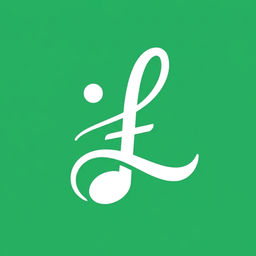
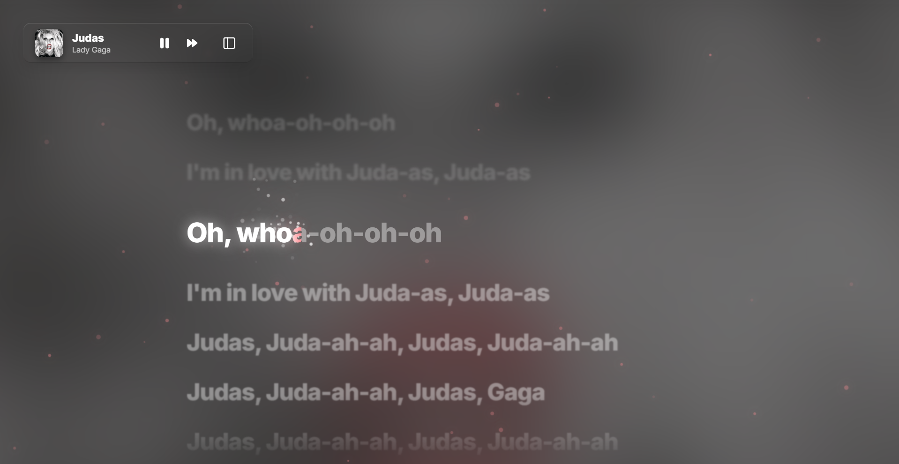
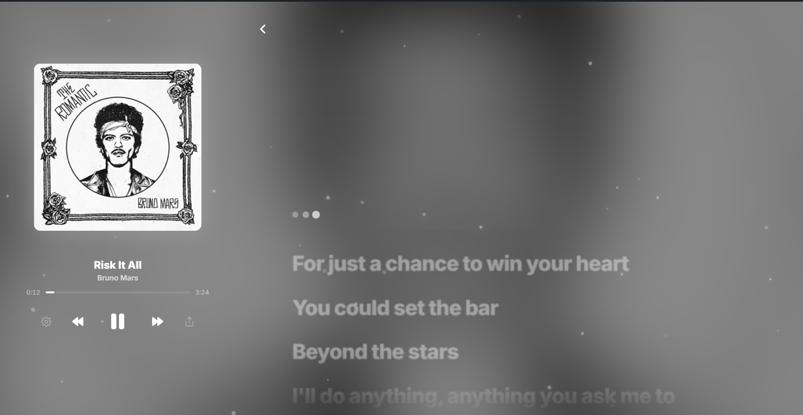
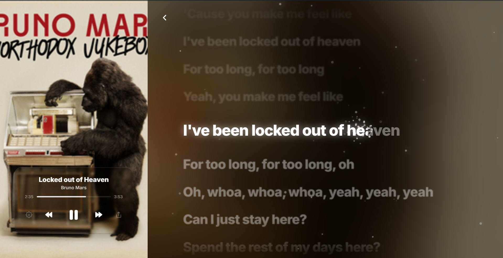

<div align="center">
  
  <h1>Lyrical</h1>
  <p><i>"Just a small idea that came up in my mind when I was tired of plain Spotify lyrics. Inspired by Apple Music design."</i></p>

  [](https://www.python.org/)
  [](LICENSE)
  [](https://www.microsoft.com/windows)
</div>

---

## 📸 Preview

<p align="center">
   

  <br><i>Minimized Sidebar Layout</i>
</p>

<p align="center">
   
   
  <br><i>Spotify Layout & Apple Layout</i>
</p>

---

## ✨ Features

*   **🎯 Native Universal Sync**: No API tokens or Spotify developer setups required. If Windows says it's playing, Lyrical shows it.
*   **🎨 Dynamic Color Engine**: Automatically samples the dominant colors of your album art to create a saturated, immersive atmosphere.
*   **✨ Apple-Grade Glassmorphism**: Stunning "Liquid Glass" UI with high-saturation blurs and depth-based reflections.
*   **🔥 Particle Emitters**: Interactive glowing particles that emerge from the lyrics as they are sung.
*   **📱 Dual-Mode Layout**: Switch instantly between the immersive **Apple Layout** and the classic, clean **Spotify Layout**.
*   **💾 Persistent Caching**: Remembers lyrics for songs you've played before for instant, zero-wait loading.

---

## 🚀 Getting Started

### Option 1: Standalone (Recommended)
1. Download `Lyrical.exe` from the [Releases](https://github.com/MellowLaw/lyrics/releases) page.
2. Run it. That's it!

### Option 2: From Source
1. **Clone the repo**:
   ```bash
   git clone https://github.com/MellowLaw/lyrics.git
   ```
2. **Install requirements**:
   ```bash
   pip install -r requirements.txt
   ```
3. **Launch**:
   ```bash
   python backend.py
   ```

---

## 🛠️ Built With

*   **Backend**: Python (Flask, Windows SDK, PyWebView)
*   **Frontend**: Vanilla JS, HTML5 Canvas, Modern CSS3
*   **Data Source**: LRCLIB Community API

---

## 🛡️ Security & Privacy 🔒
*   **100% Local**: No personal data, passwords, or music history ever leaves your machine.
*   **Secure Backend**: Internal communication is restricted via CORS to ensure only the Lyrical window can talk to the backend.
*   **Safe Caching**: Cached lyrics are stored locally on your machine for speed, with zero tracking or data collection.

---

<div align="center">
  Developed with ❤️ by [MellowLaw] (https://github.com/MellowLaw)
</div>
